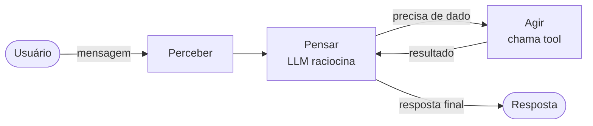

# O que é um Agente de IA?

<!--
Seção de abertura. O objetivo aqui é criar uma intuição clara sobre a diferença entre chamar um LLM diretamente e usar um agente. Muita gente confunde os dois.
-->

---

# LLM vs Agente

<div class="grid grid-cols-2 gap-8 mt-4">
<div class="card card-slate" style="background:#f8fafc;border:1px solid #cbd5e1">

**LLM puro**

- Recebe texto → devolve texto
- Stateless por natureza
- Sem acesso ao mundo externo
- Uma única chamada de API

```
User: Qual é o clima agora?
LLM:  Não tenho acesso a dados em tempo real.
```

</div>
<div class="card card-blue">

**Agente**

- Percebe → Pensa → Age → repete
- Mantém contexto e memória
- Usa ferramentas (tools)
- Múltiplas iterações até concluir

```
User: Qual é o clima agora?
Agent: [chama weather_tool("São Paulo")]
Tool:  {"temp": 24, "cond": "nublado"}
Agent: Está 24°C e nublado em São Paulo.
```

</div>
</div>

<!--
O exemplo do clima é proposital — é a limitação mais conhecida de LLMs. Use isso como gancho.

Ponto central: um LLM é uma função pura. Entrada entra, saída sai, acabou. Um agente é um processo — ele pode iterar, buscar dados, tomar decisões e tentar de novo.

A palavra "stateless" vale uma pausa: o modelo não lembra de você entre chamadas. É o framework ao redor dele que gerencia o histórico.

Clique para revelar o lado direito antes de continuar.
-->

---

# O Loop do Agente



<div class="mt-8 grid grid-cols-3 gap-5 text-center text-sm">
<div class="card card-blue">

**Perceber**

Recebe input do usuário + contexto da sessão

</div>
<div class="card card-green">

**Pensar**

LLM decide: responder direto ou invocar tool

</div>
<div class="card card-orange">

**Agir**

Executa ferramenta, obtém resultado, re-raciocina

</div>
</div>

<!--
Destaque a seta de volta do "Agir" para o "Pensar" — esse loop é o coração do agente. O LLM pode chamar várias ferramentas em sequência antes de dar a resposta final.

Analogia útil: é como um analista que recebe uma pergunta, vai buscar dados em sistemas diferentes, consolida e só então responde — em vez de responder de cabeça na hora.

O ADK que vamos usar implementa exatamente esse loop. Vocês não precisam escrever ele — só definir o agente e as ferramentas.
-->

---

# Componentes de um Agente

<div class="grid grid-cols-2 gap-8 mt-2">
<div>

<div class="mb-4">
<p class="font-bold mb-1">Model</p>
<p class="text-sm text-slate-600">O LLM que serve como cérebro do agente <em>(ex: Gemini 2.5 Flash)</em></p>
</div>

<div>
<p class="font-bold mb-1">Tools</p>
<p class="text-sm text-slate-600">Funções que o agente pode invocar <em>(busca, APIs, banco de dados…)</em></p>
</div>

</div>
<div>

<div class="mb-4">
<p class="font-bold mb-1">Memory</p>
<ul class="text-sm text-slate-600 list-disc ml-4">
  <li><strong>In-context</strong>: mensagens na janela atual</li>
  <li><strong>Session</strong>: histórico da conversa</li>
  <li><strong>Long-term</strong>: vetores, banco de dados</li>
</ul>
</div>

<div>
<p class="font-bold mb-1">Instructions</p>
<p class="text-sm text-slate-600">O system prompt — define persona, regras e capacidades do agente</p>
</div>

</div>
</div>

<div class="hl hl-blue mt-6 text-center text-sm">

Um agente é: **LLM + Tools + Memory + Instructions** rodando em loop

</div>

<!--
Percorra cada componente rapidamente — o objetivo não é aprofundar em cada um agora, mas criar um vocabulário compartilhado para o resto do workshop.

Memory vale um comentário extra: no nosso projeto vamos usar InMemoryService do ADK, que é o nível de Session. Long-term memory (vetores, RAG) está fora do escopo de hoje.

A fórmula no final é o resumo que vale carregar para o live code.
-->

---
layout: center
class: text-center
---

# Agente de IA é software.

<p class="mt-4 text-slate-500 text-xl">Nada mais que isso.</p>

<!--
Desmistificação intencional. Antes de entrar em frameworks e ferramentas, vale ancorar: no final do dia, um agente é um programa Go que chama uma API. Tem loop, tem if, tem função. A "inteligência" vem do modelo — o agente é só a estrutura ao redor.

Pause aqui. Deixe a frase respirar.
-->
