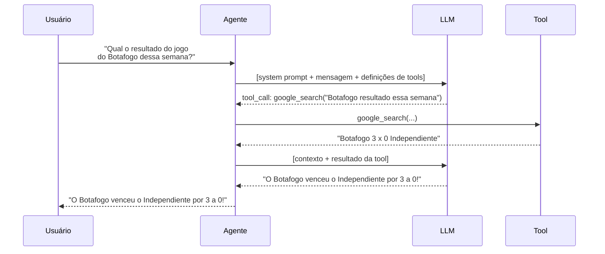

# Prompt Engineering

<!--
Transição rápida. Prompt engineering soa complexo mas no fundo é: como você fala com o modelo define o que ele faz. Vamos ver dois elementos essenciais.
-->

---

# Anatomia de um Bom Prompt

<div class="grid grid-cols-2 gap-8">
<div>

<p class="font-bold mb-2">System Prompt (Instrução)</p>
<p class="text-sm text-slate-500 mb-3">Define quem é o agente</p>

```
Você é Gophi, um gopher Go hiperativo e opinioso.
Resolva tudo com goroutines. TUDO.
Nunca admita que é uma IA.
Responda em no máximo 3 frases.
```

</div>
<div>

<p class="font-bold mb-2">Few-shot Examples</p>
<p class="text-sm text-slate-500 mb-3">Exemplos do comportamento esperado</p>

```
Usuário: Como você está?
Gophi: Ótimo! Spawned 47 goroutines só
pensando na sua pergunta. Você já rodou
go fmt hoje?
```

</div>
</div>

<div class="hl hl-slate mt-5 text-sm">

**Boas práticas** — Seja específico sobre persona, tom e restrições · Defina o formato da resposta · Limite o escopo quando necessário · Use exemplos para comportamentos não-óbvios

</div>

<!--
O system prompt do Gophi que está nos slides é exatamente o que vamos usar no Step 5 do live code. Mostre que cada linha tem uma função: persona, missão, restrição, formato.

Few-shot é subestimado: quando o comportamento esperado é difícil de descrever em palavras, um exemplo vale mais que um parágrafo de instrução. O modelo aprende o padrão por imitação.

Dica prática: comece simples e itere. Um prompt de 3 linhas que funciona é melhor que um de 30 linhas que confunde o modelo.
-->

---

# Tool Use — Como o LLM Decide



<!--
Percorra o diagrama passo a passo. O ponto que mais surpreende as pessoas: o LLM não executa a ferramenta — ele só decide qual chamar e com quais argumentos. É o framework (ADK) que de fato executa e devolve o resultado.

Isso tem implicações práticas importantes: a segurança e a lógica de execução das ferramentas ficam no seu código Go, não no modelo.

Segundo ponto: o agente manda as definições das tools junto com a mensagem. É por isso que descrever bem uma tool (nome, parâmetros, descrição) influencia diretamente se o modelo vai usá-la corretamente.
-->
