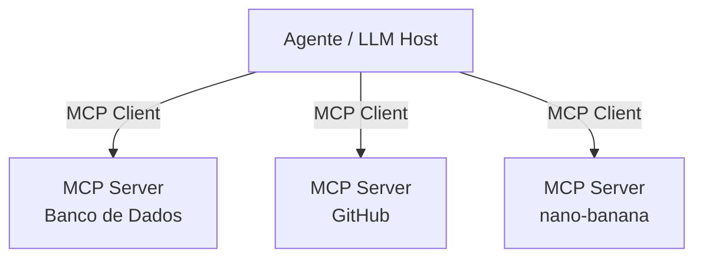

# MCP
## Model Context Protocol

<!--
MCP é um dos tópicos mais quentes do momento em IA. Vale dedicar um minuto para contextualizar por que ele surgiu antes de mostrar o que é.
-->

---

# O que é o MCP?

<div class="grid grid-cols-2 gap-8 mt-2">
<div>

<div class="mb-4">
<p class="font-bold mb-1">Problema</p>
<p class="text-sm text-slate-600">Cada agente precisa implementar integrações do zero. Sem padrão = duplicação, inconsistência e acoplamento.</p>
</div>

<div class="mb-4">
<p class="font-bold mb-1">Solução</p>
<p class="text-sm text-slate-600">MCP é um protocolo aberto (criado pela Anthropic) que padroniza como agentes se conectam a ferramentas e fontes de dados.</p>
</div>

<blockquote>"USB-C para agentes de IA"</blockquote>

</div>
<div>

<p class="font-bold mb-2">Arquitetura</p>



</div>
</div>

<!--
A analogia do USB-C é a mais eficiente que existe para explicar MCP. Antes do USB-C, cada fabricante tinha seu conector. Antes do MCP, cada agente tinha sua forma de conectar ferramentas.

Reforce: foi criado pela Anthropic mas é um padrão aberto. O Antigravity CLI, o Claude, o Cursor, o Windsurf — todos suportam MCP. Você escreve um servidor MCP uma vez e ele funciona com qualquer host compatível.

No nosso caso: o nano-banana é um MCP server em Go que expõe ferramentas de geração de imagem. O Antigravity CLI atua como host.
-->

---

# MCP na Prática

<div class="grid grid-cols-2 gap-8">
<div>

<p class="font-bold mb-2">Transport</p>
<ul class="text-sm text-slate-700 list-disc ml-4 mb-4">
  <li><code>stdio</code> — processo local, via stdin/stdout</li>
  <li><code>HTTP + SSE</code> — servidor remoto, stream de eventos</li>
</ul>

<p class="font-bold mb-2">Primitivas</p>
<ul class="text-sm text-slate-700 list-disc ml-4">
  <li><code>tools</code> — funções que o LLM pode invocar</li>
  <li><code>resources</code> — dados que o LLM pode ler</li>
  <li><code>prompts</code> — templates reutilizáveis</li>
</ul>

</div>
<div>

**Configuração (Antigravity CLI)**

```json
// ~/.gemini/config/mcp_config.json
{
  "mcpServers": {
    "nano-banana": {
      "serverUrl": "http://localhost:8080/"
    }
  }
}
```

**Implementação em Go**

```go
// Servidor MCP mínimo com HTTP SSE
http.HandleFunc("/", mcpHandler)
http.ListenAndServe(":8080", nil)
```

</div>
</div>

<!--
Foque no transporte HTTP + SSE — é o que usamos no workshop. SSE (Server-Sent Events) permite que o servidor envie eventos pro cliente sem precisar de WebSocket.

Das três primitivas, tools é a que vamos usar. Resources e prompts existem mas ficam fora do escopo de hoje.

A configuração do Antigravity CLI é um JSON dedicado (`mcp_config.json`, não mais inline no settings.json) com a URL do servidor — é tudo que o host precisa para descobrir e usar as ferramentas automaticamente.

Atenção ao campo: no Antigravity CLI o campo de servidor remoto chama-se `serverUrl`. Se errar o nome, o server falha em silêncio, sem mensagem de erro.
-->
