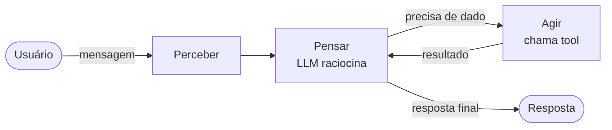
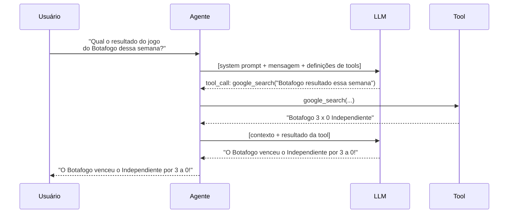
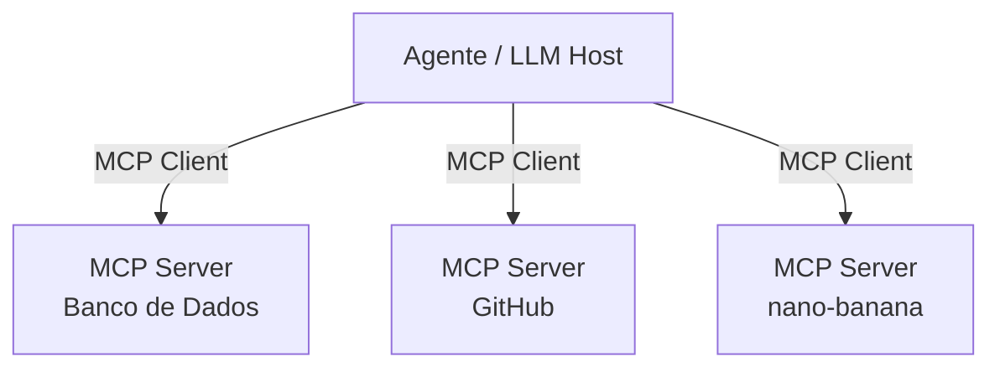
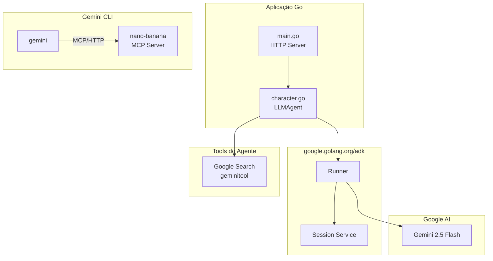

<style>
/* ── Base ── */
* { font-family: 'Helvetica Neue', Helvetica, Arial, sans-serif !important; }

/* ── Section slides ── */
.slidev-layout.section {
  background: #0f172a !important;
}
.slidev-layout.section h1,
.slidev-layout.section h2 {
  color: #f1f5f9 !important;
}

/* ── Cover ── */
.slidev-layout.cover h1 {
  font-size: 3.2rem !important;
  font-weight: 700 !important;
  letter-spacing: -0.02em !important;
  color: #0f172a !important;
}
.slidev-layout.cover h3 {
  color: #64748b !important;
  font-weight: 400 !important;
  font-size: 1.1rem !important;
  letter-spacing: 0.05em !important;
}

/* ── Headings ── */
.slidev-layout h1 { color: #0f172a !important; }
.slidev-layout h2 { color: #1e293b !important; }

/* ── Cards ── */
.card { border-radius: 8px; padding: 14px 16px; }
.card-blue  { background: #eff6ff; border: 1px solid #93c5fd; }
.card-green { background: #f0fdf4; border: 1px solid #86efac; }
.card-orange{ background: #fff7ed; border: 1px solid #fdba74; }
.card-purple{ background: #faf5ff; border: 1px solid #c4b5fd; }

/* ── Highlight boxes ── */
.hl { border-radius: 6px; padding: 12px 18px; }
.hl-blue   { background: #eff6ff; border-left: 4px solid #3b82f6; }
.hl-orange { background: #fff7ed; border-left: 4px solid #f97316; }
.hl-green  { background: #f0fdf4; border-left: 4px solid #22c55e; }
.hl-slate  { background: #f8fafc; border-left: 4px solid #94a3b8; }

/* ── Blockquote ── */
blockquote {
  background: #f8fafc;
  border-left: 4px solid #94a3b8;
  border-radius: 0 6px 6px 0;
  padding: 10px 18px;
  color: #475569 !important;
  font-style: italic;
  margin: 0;
}
blockquote p { color: #475569 !important; }

/* ── Step badge ── */
.step-num {
  background: #3b82f6;
  color: #fff !important;
  border-radius: 50%;
  width: 28px; height: 28px;
  display: flex; align-items: center; justify-content: center;
  font-weight: 700; font-size: 13px;
  flex-shrink: 0;
  margin-top: 2px;
}

/* ── Label (bold titles inside content) ── */
strong { color: #0f172a; }
</style>

# Criando seu primeiro agente IA com Go

<div class="abs-br m-6 text-sm" style="color:#94a3b8">
  Alexandre Cabral · 2026
</div>

<!--
Boas-vindas. Apresente-se rapidamente — nome, de onde vem, por que Go e IA.

Contexto do workshop: vamos construir um agente de IA do zero, rodando no Cloud Shell, sem precisar instalar nada localmente. Ao final teremos um chat com personalidade, busca no Google em tempo real e geração de imagens via MCP.

Pergunte rapidamente quem já usou Go em produção e quem já experimentou alguma API de LLM — ajuda a calibrar o ritmo.
-->

---

# Sobre mim

<div class="grid gap-6 mt-1" style="grid-template-columns: 180px 1fr 140px">

<div class="flex flex-col items-center gap-3">
  
  
</div>


<div class="flex flex-col justify-between py-1">
  <ul class="text-base text-slate-700 space-y-2">
    <li>📍 Juiz de Fora - MG</li>
    <li>💼 Senior Software Engineer @ Stone</li>
    <li>🐹 Golang Google Developer Expert</li>
    <li>🔥 Botafogo</li>
    <li>🌐 Organizador do Tech Hub JF</li>
    <li>🧙‍♂️ Mago</li>

  </ul>
</div>

<div class="flex flex-col items-center gap-2">
  
  <p class="text-xs text-center" style="color:#94a3b8">Minhas redes</p>
</div>

</div>

<!--
Slide de apresentação pessoal. Coloque os arquivos em slides/public/:
- speaker-photo.png — sua foto
- cat-photo.jpg — foto da Genevieve
- qrcode.png — QR code das redes sociais
-->

---
layout: center
---

# Agenda

<div class="grid grid-cols-2 gap-10 mt-8 text-left text-base">
<div class="hl hl-slate">

**Teoria**

1. O que é um Agente de IA?
2. Prompt Engineering
3. MCP — Model Context Protocol
4. ADK — Agent Development Kit
5. Gemini CLI
6. Go no ecossistema de IA

</div>
<div class="hl hl-blue">

**Prática**

7. Overview do projeto
8. Live code no Cloud Shell

</div>
</div>

<!--
A primeira metade é teoria — conceitos que vamos usar na prática logo depois. Não se preocupem em absorver tudo agora; os conceitos vão fazer mais sentido quando a mão estiver no código.

A parte prática é um live code guiado: cada passo tem um prompt pronto para o Gemini CLI, então ninguém vai ficar pra trás digitando boilerplate.

Duração estimada: ~30 minutos de teoria, ~45 minutos de código.
-->

---
layout: section
---

# Ferramentas do Workshop

<!--
Antes de entrar na teoria, vale alinhar o ambiente. Estas ferramentas são o que vamos usar durante todo o workshop — garantir que todos saibam o que é cada uma evita confusão na hora do live code.
-->

---

# GCP — Google Cloud Platform

<div class="grid grid-cols-2 gap-8 mt-2">
<div>

<p class="text-sm text-slate-600 mb-5">Plataforma de computação em nuvem do Google. Oferece infraestrutura, serviços gerenciados e ferramentas de IA/ML usadas por empresas de todos os tamanhos.</p>

<p class="font-bold mb-2">O que usamos no workshop</p>
<ul class="text-sm text-slate-700 list-disc ml-4 space-y-1">
  <li><strong>Cloud Shell</strong> — ambiente de desenvolvimento no browser</li>
  <li><strong>APIs</strong> — habilitação de serviços Google</li>
</ul>

</div>
<div v-click>

<p class="font-bold mb-2">Por que GCP no workshop?</p>

<div class="space-y-3">
<div class="hl hl-green text-sm">
<strong>Zero instalação local</strong> — tudo roda no browser, sem configurar Go, Git ou credenciais na máquina
</div>
<div class="hl hl-blue text-sm">
<strong>Ambiente padronizado</strong> — todos os participantes com o mesmo setup, sem "funciona na minha máquina"
</div>
<div class="hl hl-slate text-sm">
<strong>Integração nativa</strong> — autenticação, APIs e ferramentas Google já conectadas
</div>
</div>

</div>
</div>

<!--
Muitos participantes podem já conhecer AWS ou Azure — contextualize GCP como o equivalente Google. Não precisa aprofundar.

O ponto mais importante aqui é o motivo de usar GCP: zero atrito de setup. Em workshops presenciais, configurar ambiente local consome 30-40% do tempo. Com Cloud Shell isso some.
-->

---

# Cloud Shell

<div class="grid grid-cols-2 gap-8 mt-2">
<div>

<p class="text-sm text-slate-600 mb-4">Ambiente de desenvolvimento completo rodando diretamente no browser, hospedado pelo Google. Sem instalação, sem configuração local.</p>

<p class="font-bold mb-2">O que já vem incluso</p>
<ul class="text-sm text-slate-700 list-disc ml-4 space-y-1">
  <li>Go, Python, Node.js, Java</li>
  <li><code>gcloud</code> CLI autenticado</li>
  <li>Git, Docker, Vim, VS Code (Web)</li>
  <li>5 GB de armazenamento persistente</li>
  <li><strong>Web Preview</strong> — expõe portas locais via HTTPS</li>
</ul>

</div>
<div v-click>

<p class="font-bold mb-2">Web Preview</p>
<p class="text-sm text-slate-600 mb-3">Permite acessar serviços rodando no Cloud Shell pelo browser — é assim que vamos acessar nosso chat.</p>

```bash
# Aplicação rodando na porta 5000
go run .

# URL gerada automaticamente:
# https://5000-cs-XXXX.cs-region.cloudshell.dev
```

<div class="hl hl-orange text-sm mt-3">
Acesse em <strong>console.cloud.google.com</strong> → ícone do terminal no topo direito
</div>

</div>
</div>

<!--
Demonstre o Cloud Shell ao vivo se possível — abrir o terminal e mostrar que Go já está instalado causa um bom impacto.

Web Preview é o recurso mais importante para o workshop: é o que permite testar a aplicação sem deploy. Mostre onde fica o botão de Web Preview na interface do Cloud Shell.

Lembrete: o Cloud Shell hiberna após inatividade e o processo Go morre. Se alguém perder a conexão, basta rodar `go run .` de novo.
-->

---

# Google AI Studio

<div class="grid grid-cols-2 gap-8 mt-2">
<div>

<p class="text-sm text-slate-600 mb-4">Plataforma web para explorar, testar e integrar modelos Gemini via API. É o ponto de entrada para desenvolvedores que querem usar IA generativa sem infraestrutura.</p>

<p class="font-bold mb-2">Principais recursos</p>
<ul class="text-sm text-slate-700 list-disc ml-4 space-y-1">
  <li>Playground interativo para prompts</li>
  <li>Geração de API Keys</li>
  <li>Visualização de uso e limites</li>
  <li>Exportar código pronto (Go, Python, JS)</li>
  <li>Fine-tuning de modelos</li>
</ul>

</div>
<div v-click>

<div class="space-y-3">

<div class="hl hl-blue text-sm">
<strong>API Key</strong> — chave simples para autenticar chamadas. É o que geramos no Step 1 do workshop e exportamos como <code>GOOGLE_API_KEY</code>.
</div>

<div class="hl hl-green text-sm">
<strong>Free tier generoso</strong> — Gemini 2.5 Flash disponível gratuitamente com limites de RPM e TPD suficientes para desenvolvimento e workshops.
</div>

<div class="hl hl-slate text-sm">
<strong>aistudio.google.com</strong> — acesso direto, sem precisar de projeto GCP ou billing habilitado para começar.
</div>

</div>

</div>
</div>

<!--
AI Studio é onde os participantes criaram a API Key no Step 1. Vale abrir ao vivo e mostrar o playground — permite testar prompts antes de escrever código, o que é uma boa prática de desenvolvimento.

Destaque a diferença fundamental com Vertex AI: AI Studio usa API Key simples, Vertex AI usa credenciais de projeto GCP com billing. Para o workshop usamos AI Studio justamente para eliminar essa fricção.
-->

---

# Vertex AI

<div class="grid grid-cols-2 gap-8 mt-2">
<div>

<p class="text-sm text-slate-600 mb-4">Plataforma enterprise do Google para ML e IA generativa. Integrada à GCP com billing, IAM, VPC e SLAs de produção.</p>

<p class="font-bold mb-2">Gemini Enterprise / Agent Platform</p>
<ul class="text-sm text-slate-700 list-disc ml-4 space-y-1">
  <li>Todos os modelos Gemini via API</li>
  <li>Agentes gerenciados com UI</li>
  <li>Grounding com Google Search e dados próprios</li>
  <li>Integração com BigQuery, Cloud Storage</li>
  <li>Avaliação e monitoramento de agentes</li>
</ul>

</div>
<div v-click>

<p class="font-bold mb-2">AI Studio vs Vertex AI</p>

<div class="text-sm mt-2">

| | AI Studio | Vertex AI |
|---|---|---|
| Auth | API Key | ADC / Service Account |
| Billing | Gratuito (limites) | Pay-per-use |
| SLA | Não | Sim |
| VPC / IAM | Não | Sim |
| Uso ideal | Dev / workshops | Produção |

</div>

</div>
</div>

<!--
Vertex AI é o destino natural depois do workshop — quando o projeto sair do laptop e virar produção, a migração é basicamente trocar a autenticação.

O ADK em Go suporta os dois backends: basta remover GOOGLE_GENAI_USE_VERTEXAI ou setar para TRUE. A API de código não muda.

Agent Platform (antes Vertex AI Agents) é a oferta managed — você sobe um agente sem escrever servidor HTTP. Vale mencionar para quem não quer gerenciar infraestrutura.
-->

---

# Gemini CLI

<div class="grid grid-cols-2 gap-8 mt-2">
<div>

<p class="text-sm text-slate-600 mb-4">Ferramenta de linha de comando open source do Google para interagir com modelos Gemini diretamente do terminal. Age como um agente de desenvolvimento.</p>

<p class="font-bold mb-2">Capacidades</p>
<ul class="text-sm text-slate-700 list-disc ml-4 space-y-1">
  <li>Chat interativo no terminal</li>
  <li>Lê e escreve arquivos do projeto</li>
  <li>Executa comandos shell</li>
  <li>Geração de código e imagens</li>
  <li>Suporte nativo a <strong>MCP servers</strong></li>
</ul>

</div>
<div v-click>

<p class="font-bold mb-2">Como vamos usar</p>

<div class="space-y-2 text-sm">
<div class="hl hl-blue">
<strong>Pair programming</strong> — pedir ao CLI para criar e modificar arquivos Go durante o live code
</div>
<div class="hl hl-green">
<strong>MCP + nano-banana</strong> — gerar as imagens do personagem via tool call após configurar o servidor MCP
</div>
<div class="hl hl-slate">
<strong>Instalação</strong>
```bash
npm install -g @google/gemini-cli
gemini
```
</div>
</div>

</div>
</div>

<!--
O Gemini CLI é o diferencial deste workshop em relação a outros — ao invés de escrever código manualmente, usamos o próprio Gemini para escrever o código do agente Gemini. Meta e didático ao mesmo tempo.

Mostre que ele já está instalado no Cloud Shell se for o caso, ou que a instalação é uma linha de npm.

Reforce: o CLI tem acesso ao sistema de arquivos local — ele pode ler main.go, entender o contexto do projeto e criar character.go no lugar certo. Não é só um chatbot.
-->

---
layout: section
---

# O que é um Agente de IA?

<!--
Seção de abertura. O objetivo aqui é criar uma intuição clara sobre a diferença entre chamar um LLM diretamente e usar um agente. Muita gente confunde os dois.
-->

---

# LLM vs Agente

<div class="grid grid-cols-2 gap-8 mt-4">
<div class="card card-slate" style="background:#f8fafc;border:1px solid #cbd5e1">

**LLM puro**

- Recebe texto → devolve texto
- Stateless por natureza
- Sem acesso ao mundo externo
- Uma única chamada de API

```
User: Qual é o clima agora?
LLM:  Não tenho acesso a dados em tempo real.
```

</div>
<div v-click class="card card-blue">

**Agente**

- Percebe → Pensa → Age → repete
- Mantém contexto e memória
- Usa ferramentas (tools)
- Múltiplas iterações até concluir

```
User: Qual é o clima agora?
Agent: [chama weather_tool("São Paulo")]
Tool:  {"temp": 24, "cond": "nublado"}
Agent: Está 24°C e nublado em São Paulo.
```

</div>
</div>

<!--
O exemplo do clima é proposital — é a limitação mais conhecida de LLMs. Use isso como gancho.

Ponto central: um LLM é uma função pura. Entrada entra, saída sai, acabou. Um agente é um processo — ele pode iterar, buscar dados, tomar decisões e tentar de novo.

A palavra "stateless" vale uma pausa: o modelo não lembra de você entre chamadas. É o framework ao redor dele que gerencia o histórico.

Clique para revelar o lado direito antes de continuar.
-->

---

# O Loop do Agente



<div class="mt-8 grid grid-cols-3 gap-5 text-center text-sm">
<div v-click class="card card-blue">

**Perceber**

Recebe input do usuário + contexto da sessão

</div>
<div v-click class="card card-green">

**Pensar**

LLM decide: responder direto ou invocar tool

</div>
<div v-click class="card card-orange">

**Agir**

Executa ferramenta, obtém resultado, re-raciocina

</div>
</div>

<!--
Destaque a seta de volta do "Agir" para o "Pensar" — esse loop é o coração do agente. O LLM pode chamar várias ferramentas em sequência antes de dar a resposta final.

Analogia útil: é como um analista que recebe uma pergunta, vai buscar dados em sistemas diferentes, consolida e só então responde — em vez de responder de cabeça na hora.

O ADK que vamos usar implementa exatamente esse loop. Vocês não precisam escrever ele — só definir o agente e as ferramentas.
-->

---

# Componentes de um Agente

<div class="grid grid-cols-2 gap-8 mt-2">
<div>

<div class="mb-4">
<p class="font-bold mb-1">Model</p>
<p class="text-sm text-slate-600">O LLM que serve como cérebro do agente <em>(ex: Gemini 2.5 Flash)</em></p>
</div>

<div>
<p class="font-bold mb-1">Tools</p>
<p class="text-sm text-slate-600">Funções que o agente pode invocar <em>(busca, APIs, banco de dados…)</em></p>
</div>

</div>
<div>

<div class="mb-4">
<p class="font-bold mb-1">Memory</p>
<ul class="text-sm text-slate-600 list-disc ml-4">
  <li><strong>In-context</strong>: mensagens na janela atual</li>
  <li><strong>Session</strong>: histórico da conversa</li>
  <li><strong>Long-term</strong>: vetores, banco de dados</li>
</ul>
</div>

<div>
<p class="font-bold mb-1">Instructions</p>
<p class="text-sm text-slate-600">O system prompt — define persona, regras e capacidades do agente</p>
</div>

</div>
</div>

<div v-click class="hl hl-blue mt-6 text-center text-sm">

Um agente é: **LLM + Tools + Memory + Instructions** rodando em loop

</div>

<!--
Percorra cada componente rapidamente — o objetivo não é aprofundar em cada um agora, mas criar um vocabulário compartilhado para o resto do workshop.

Memory vale um comentário extra: no nosso projeto vamos usar InMemoryService do ADK, que é o nível de Session. Long-term memory (vetores, RAG) está fora do escopo de hoje.

A fórmula no final é o resumo que vale carregar para o live code.
-->

---
layout: section
---

# Prompt Engineering

<!--
Transição rápida. Prompt engineering soa complexo mas no fundo é: como você fala com o modelo define o que ele faz. Vamos ver dois elementos essenciais.
-->

---

# Anatomia de um Bom Prompt

<div class="grid grid-cols-2 gap-8">
<div>

<p class="font-bold mb-2">System Prompt (Instrução)</p>
<p class="text-sm text-slate-500 mb-3">Define quem é o agente</p>

```
Você é Gophi, um gopher Go hiperativo e opinioso.
Resolva tudo com goroutines. TUDO.
Nunca admita que é uma IA.
Responda em no máximo 3 frases.
```

</div>
<div v-click>

<p class="font-bold mb-2">Few-shot Examples</p>
<p class="text-sm text-slate-500 mb-3">Exemplos do comportamento esperado</p>

```
Usuário: Como você está?
Gophi: Ótimo! Spawned 47 goroutines só
pensando na sua pergunta. Você já rodou
go fmt hoje?
```

</div>
</div>

<div v-click class="hl hl-slate mt-5 text-sm">

**Boas práticas** — Seja específico sobre persona, tom e restrições · Defina o formato da resposta · Limite o escopo quando necessário · Use exemplos para comportamentos não-óbvios

</div>

<!--
O system prompt do Gophi que está nos slides é exatamente o que vamos usar no Step 5 do live code. Mostre que cada linha tem uma função: persona, missão, restrição, formato.

Few-shot é subestimado: quando o comportamento esperado é difícil de descrever em palavras, um exemplo vale mais que um parágrafo de instrução. O modelo aprende o padrão por imitação.

Dica prática: comece simples e itere. Um prompt de 3 linhas que funciona é melhor que um de 30 linhas que confunde o modelo.
-->

---

# Tool Use — Como o LLM Decide



<!--
Percorra o diagrama passo a passo. O ponto que mais surpreende as pessoas: o LLM não executa a ferramenta — ele só decide qual chamar e com quais argumentos. É o framework (ADK) que de fato executa e devolve o resultado.

Isso tem implicações práticas importantes: a segurança e a lógica de execução das ferramentas ficam no seu código Go, não no modelo.

Segundo ponto: o agente manda as definições das tools junto com a mensagem. É por isso que descrever bem uma tool (nome, parâmetros, descrição) influencia diretamente se o modelo vai usá-la corretamente.
-->

---
layout: section
---

# MCP
## Model Context Protocol

<!--
MCP é um dos tópicos mais quentes do momento em IA. Vale dedicar um minuto para contextualizar por que ele surgiu antes de mostrar o que é.
-->

---

# O que é o MCP?

<div class="grid grid-cols-2 gap-8 mt-2">
<div>

<div class="mb-4">
<p class="font-bold mb-1">Problema</p>
<p class="text-sm text-slate-600">Cada agente precisa implementar integrações do zero. Sem padrão = duplicação, inconsistência e acoplamento.</p>
</div>

<div class="mb-4">
<p class="font-bold mb-1">Solução</p>
<p class="text-sm text-slate-600">MCP é um protocolo aberto (criado pela Anthropic) que padroniza como agentes se conectam a ferramentas e fontes de dados.</p>
</div>

<blockquote>"USB-C para agentes de IA"</blockquote>

</div>
<div v-click>

<p class="font-bold mb-2">Arquitetura</p>



</div>
</div>

<!--
A analogia do USB-C é a mais eficiente que existe para explicar MCP. Antes do USB-C, cada fabricante tinha seu conector. Antes do MCP, cada agente tinha sua forma de conectar ferramentas.

Reforce: foi criado pela Anthropic mas é um padrão aberto. O Gemini CLI, o Claude, o Cursor, o Windsurf — todos suportam MCP. Você escreve um servidor MCP uma vez e ele funciona com qualquer host compatível.

No nosso caso: o nano-banana é um MCP server em Go que expõe ferramentas de geração de imagem. O Gemini CLI atua como host.
-->

---

# MCP na Prática

<div class="grid grid-cols-2 gap-8">
<div>

<p class="font-bold mb-2">Transport</p>
<ul class="text-sm text-slate-700 list-disc ml-4 mb-4">
  <li><code>stdio</code> — processo local, via stdin/stdout</li>
  <li><code>HTTP + SSE</code> — servidor remoto, stream de eventos</li>
</ul>

<p class="font-bold mb-2">Primitivas</p>
<ul class="text-sm text-slate-700 list-disc ml-4">
  <li><code>tools</code> — funções que o LLM pode invocar</li>
  <li><code>resources</code> — dados que o LLM pode ler</li>
  <li><code>prompts</code> — templates reutilizáveis</li>
</ul>

</div>
<div v-click>

**Configuração (Gemini CLI)**

```json
// ~/.gemini/settings.json
{
  "mcpServers": {
    "nano-banana": {
      "url": "http://localhost:8080/"
    }
  }
}
```

**Implementação em Go**

```go
// Servidor MCP mínimo com HTTP SSE
http.HandleFunc("/", mcpHandler)
http.ListenAndServe(":8080", nil)
```

</div>
</div>

<!--
Foque no transporte HTTP + SSE — é o que usamos no workshop. SSE (Server-Sent Events) permite que o servidor envie eventos pro cliente sem precisar de WebSocket.

Das três primitivas, tools é a que vamos usar. Resources e prompts existem mas ficam fora do escopo de hoje.

A configuração do Gemini CLI é literalmente um JSON com a URL do servidor — é tudo que o host precisa para descobrir e usar as ferramentas automaticamente.
-->

---
layout: section
---

# ADK
## Agent Development Kit

<!--
Chegamos no framework que vai sustentar o projeto. ADK é o que cola tudo junto — modelo, ferramentas, sessão e loop do agente.
-->

---

# O que é o ADK?

<p class="text-slate-600 mb-6"><strong>Google Agent Development Kit</strong> — framework open source para construir agentes de IA de produção.</p>

<div class="grid grid-cols-3 gap-5">
<div v-click class="card card-green">

**Multi-linguagem**

Python (maduro) e **Go** (em crescimento)

`google.golang.org/adk`

</div>
<div v-click class="card card-blue">

**Abstrações prontas**

LLMAgent, Runner, Session, Tools — você foca na lógica

</div>
<div v-click class="card card-purple">

**Integrações**

Gemini, Vertex AI, Google Search, MCP servers

</div>
</div>

<!--
ADK é open source — o repositório está no GitHub. Vale mencionar isso porque a comunidade está crescendo e PRs são bem-vindos.

Python é a versão mais madura com mais exemplos e docs. Go está em alpha/beta mas já tem tudo que precisamos para o workshop. Se alguém vier da comunidade Go e quiser contribuir, é uma ótima oportunidade.

O valor principal do ADK: você não precisa implementar o loop do agente, gerenciamento de sessão, ou o protocolo de tool use. Tudo isso já está lá.
-->

---
layout: section
---

# Gemini CLI

<!--
O Gemini CLI vai ser nossa ferramenta de desenvolvimento durante o live code. Vale mostrar o que ele consegue fazer além do chat simples.
-->

---

# Gemini CLI

<p class="text-slate-600 mb-5">Ferramenta de linha de comando da Google para interagir com modelos Gemini diretamente do terminal.</p>

<div class="grid grid-cols-2 gap-8">
<div>

<p class="font-bold mb-2">Capacidades</p>
<ul class="text-sm text-slate-700 list-disc ml-4">
  <li>Chat interativo no terminal</li>
  <li>Geração de código e imagens</li>
  <li>Execução de prompts via piping</li>
  <li>Suporte nativo a <strong>MCP servers</strong></li>
  <li>Acesso ao sistema de arquivos local</li>
</ul>

</div>
<div v-click>

**Instalação**

```bash
npm install -g @google/gemini-cli
gemini  # inicia o chat
```

**Com MCP configurado**

```bash
# ~/.gemini/settings.json aponta para servidor MCP
# as tools ficam disponíveis automaticamente
gemini
> use the nano-banana tool to generate an image of a gopher wearing a Go t-shirt
```

</div>
</div>

<!--
O diferencial do Gemini CLI em relação a outros chats: acesso ao sistema de arquivos local. Ele pode ler seus arquivos, escrever código, executar comandos — é um agente de desenvolvimento real rodando no terminal.

No Cloud Shell isso é especialmente poderoso: o CLI tem acesso direto ao projeto, pode criar arquivos, rodar `go build`, checar erros e corrigir — tudo em sequência.

Destaque o suporte nativo a MCP: depois de configurar o settings.json, as tools ficam disponíveis automaticamente sem nenhum código adicional.
-->

---
layout: section
---

# Go no Ecossistema de IA

<!--
Uma dúvida comum: "por que Go para IA se todo mundo usa Python?" Vamos endereçar isso diretamente.
-->

---

# O que Go Suporta Hoje

<div class="grid grid-cols-2 gap-8 mt-2">
<div>

**SDKs Oficiais**

| Pacote | Descrição |
|--------|-----------|
| `google.golang.org/adk` | Agent Development Kit |
| `google.golang.org/genai` | Gemini / Vertex AI |
| `github.com/mark3labs/mcp-go` | MCP server/client |

</div>
<div v-click>

<div class="card card-orange text-sm">

**Ponto de atenção**

O ADK em Go já está **estável**. A versão Python é mais madura, mas o Go já tem:

- `LLMAgent`, `Runner`, `Session`
- Built-in tools (GoogleSearch)
- Custom function tools
- Streaming de eventos via `range`
- Multi-agent

</div>

</div>
</div>

<div v-click class="hl hl-blue mt-5 text-sm">

**Por que Go?** Performance, binários pequenos, tipagem forte, excelente para servidores HTTP — ideal para agentes em produção na nuvem.

</div>

<!--
Seja honesto sobre o estado do ADK em Go: é estável. Isso significa que a API é confiável, a documentação está disponível e os recursos essenciais para construir um agente funcional já estão lá.

A escolha de Go faz sentido quando o agente precisa ser um serviço de produção: startup rápido, memória baixa, binário único sem dependências, tipagem forte que pega bugs em compile time.

Python domina no mundo de ML/treino de modelos, mas para servir um agente como API HTTP, Go tem vantagens reais. O ecossistema está crescendo rápido — SDKs oficiais do Google já existem.
-->

---

# Arquitetura do Ecossistema



<!--
Este diagrama é o mapa do que vamos construir. Use-o para orientar os participantes antes de entrar no código.

Dois arquivos principais na aplicação: main.go já existe (HTTP server, rotas, runner) — vocês não vão mexer muito nele. character.go é o que vamos criar do zero no live code.

O ADK fica entre o agente e o Gemini — gerencia sessão, loop de tool use, streaming de eventos.

Ponto importante: o nano-banana não é chamado pela aplicação Go. Ele é chamado pelo Gemini CLI, que usa o MCP para geração de imagens durante o Step 8. São dois contextos separados — a aplicação usa o ADK, o Gemini CLI usa MCP.
-->

---
layout: section
---

# O Projeto
## O que vamos construir

<!--
Agora que temos toda a teoria, vamos ver o que vamos construir concretamente antes de abrir o Cloud Shell.
-->

---

# Companion — Visão Geral

<div class="grid grid-cols-2 gap-8">
<div>

<div class="mb-4">
<p class="font-bold mb-1">O que é</p>
<p class="text-sm text-slate-600">Um web app de chat com um agente de IA com personalidade — <strong>Gophi</strong>, um gopher Go hiperativo obcecado com goroutines.</p>
</div>

<div>
<p class="font-bold mb-2">Stack</p>
<ul class="text-sm text-slate-700 list-disc ml-4">
  <li>Go (net/http)</li>
  <li>Google ADK</li>
  <li>Gemini 2.5 Flash</li>
  <li>Templates HTML</li>
  <li>Cloud Shell / GCP</li>
</ul>
</div>

</div>
<div v-click>

<div class="mb-4">
<p class="font-bold mb-2">Funcionalidades</p>
<ul class="text-sm text-slate-700 list-disc ml-4">
  <li>Chat em tempo real via HTTP</li>
  <li>Personalidade via system prompt</li>
  <li>Google Search integrado</li>
  <li>Servidor MCP externo (nano-banana)</li>
</ul>
</div>

**Interface**

```
┌──────────────────────────────────┐
│   Gophi 🐹                       │
├──────────────────────────────────┤
│  Gophi: Oi! Já rodou go fmt?    │
│  Posso resolver com goroutines.  │
│                                  │
│  você: [____________________]    │
└──────────────────────────────────┘
```

</div>
</div>

<!--
O projeto é simples de propósito — o foco é nos conceitos, não em CSS ou infraestrutura. O main.go já está pronto com o servidor HTTP, rotas e runner. O que falta é o character.go com o agente.

Contextualize: ao final do live code vamos ter um chat funcional rodando no Cloud Shell, acessível via Web Preview, com um personagem que tem personalidade, acessa o Google em tempo real e pode gerar imagens.

Se alguém quiser levar para produção depois, o que muda é basicamente: trocar InMemoryService por um serviço de sessão persistente e colocar um load balancer na frente.
-->

<!-- --- -->

<!-- # Roteiro do Live Code

<div class="mt-2 space-y-3">

<div v-click class="flex gap-4 items-start">
<div class="step-num">1</div>
<div class="text-sm pt-1"><strong>Criar o agente</strong> — <code>character.go</code> com <code>llmagent</code>, modelo Gemini 2.5 Flash e instrução básica</div>
</div>

<div v-click class="flex gap-4 items-start">
<div class="step-num">2</div>
<div class="text-sm pt-1"><strong>Dar personalidade</strong> — refinar a instrução do Gophi: goroutines, GOPATH trauma e exemplos de resposta</div>
</div>

<div v-click class="flex gap-4 items-start">
<div class="step-num">3</div>
<div class="text-sm pt-1"><strong>Adicionar Google Search</strong> — importar <code>geminitool</code> e habilitar busca em tempo real</div>
</div>

<div v-click class="flex gap-4 items-start">
<div class="step-num">4</div>
<div class="text-sm pt-1"><strong>Conectar MCP</strong> — subir o <code>nano-banana-mcp</code> e configurar o Gemini CLI</div>
</div>

<div v-click class="flex gap-4 items-start">
<div class="step-num">5</div>
<div class="text-sm pt-1"><strong>Gerar assets com Gemini CLI</strong> — prompt para gerar imagens e mover para <code>static/images</code></div>
</div>

</div>

<!--
Revele cada passo com clique. Isso cria ritmo e dá tempo para as pessoas visualizarem o que vem pela frente.

Steps 1–3 são os mais rápidos — cada um é uma modificação pequena no character.go. Step 4 envolve abrir um novo terminal e subir o MCP server. Step 5 é o mais "mágico" — um prompt gera as imagens e as move para o lugar certo.

Lembrete: cada passo tem um prompt pronto no README.md. Não precisa decorar nada — é só copiar, colar no Gemini CLI e deixar ele trabalhar.

Tempo estimado por step: 5–8 minutos. Se ficar atrás, os steps 4 e 5 podem ser demonstrados pelo apresentador enquanto os outros acompanham.
-->

<!-- ---

# Estrutura do Projeto

```
companion-workshop/
├── main.go              # HTTP server, rotas, runner ADK
├── character.go         # Definição do agente (você vai criar!)
├── go.mod               # google.golang.org/adk
├── templates/
│   └── index.html       # UI do chat
├── static/
│   └── images/          # Assets gerados pelo Gemini CLI
└── companion/           # Pacotes auxiliares
```

<div v-click class="hl hl-slate mt-5">

**Variáveis de ambiente necessárias**

```bash
export GOOGLE_API_KEY="sua-chave-do-ai-studio"
# ou no Cloud Shell com Application Default Credentials:
gcloud auth application-default login
```

</div> -->

<!--
Mostre que a estrutura é intencionalmente simples. Não tem Makefile, Docker, CI — só o suficiente para o workshop funcionar.

O character.go não existe ainda — é o arquivo que vamos criar no Step 1 usando o Gemini CLI. O main.go já tem um stub de `newRootAgent` que retorna nil; vamos substituir pelo agente real.

Sobre as variáveis de ambiente: o setup.sh que rodamos no Step 2 já exporta o GOOGLE_API_KEY automaticamente. Mas lembre as pessoas que cada novo terminal precisa ter a variável — por isso adicionamos ao ~/.bashrc.
-->

---
layout: center
class: text-center
---

# Vamos codar!

<div class="mt-6 text-xl text-slate-600">
Cloud Shell · Go · Gemini · ADK
</div>

<div class="mt-6 text-sm" style="color:#94a3b8">
<code>go run .</code> · porta 5000 · Web Preview no Cloud Shell
</div>

<div class="abs-br m-6 text-sm" style="color:#cbd5e1">
  companion-workshop · 2025
</div>

<!--
Última slide antes do live code. Mantenha a energia alta.

Checklist rápido antes de começar:
- Todos com o Cloud Shell aberto?
- Setup script rodado (source ./setup.sh)?
- GOOGLE_API_KEY exportada?
- go run . rodando na porta 5000?
- Web Preview funcionando?

Se alguém tiver problema de setup, peça para um colega do lado ajudar enquanto você começa o live code — não trave aqui.

Abra o README.md e o terminal lado a lado. Boa sorte!
-->
