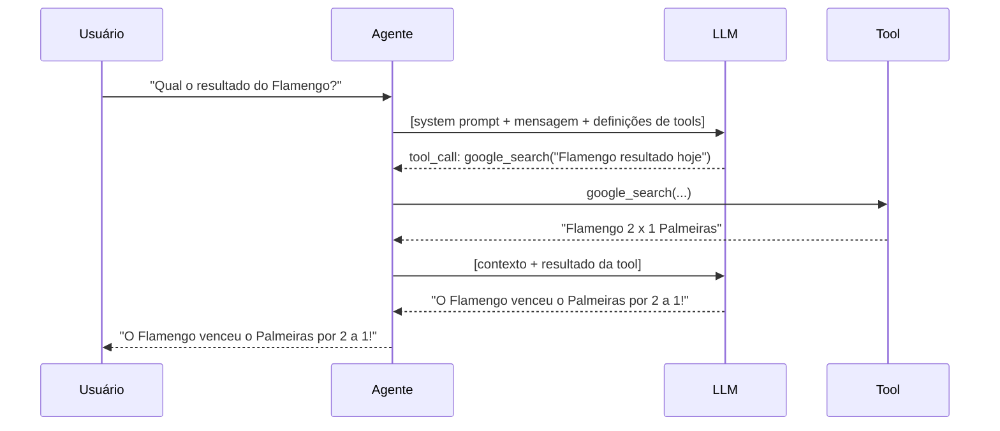
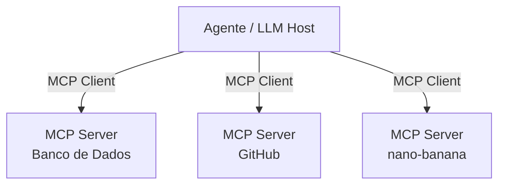
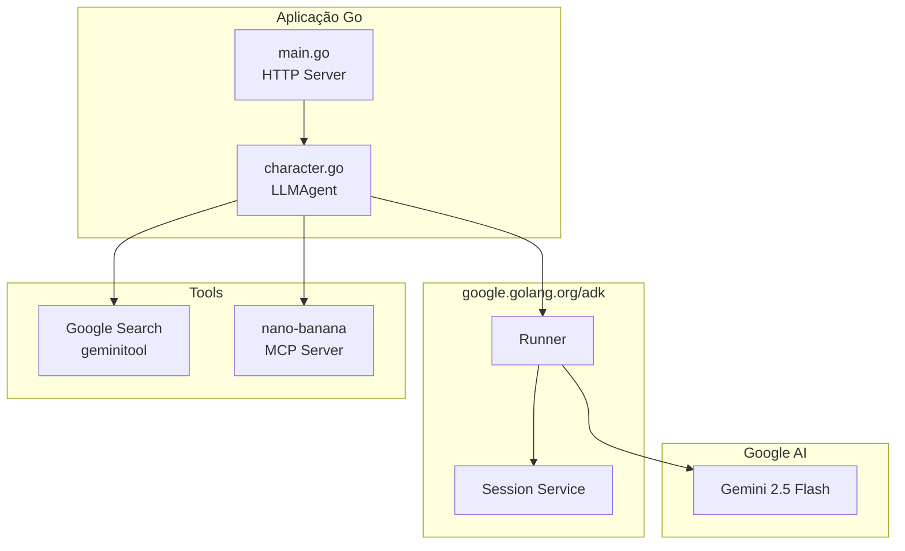

<style>
/* ── Base ── */
* { font-family: 'Helvetica Neue', Helvetica, Arial, sans-serif !important; }

/* ── Section slides ── */
.slidev-layout.section {
  background: #0f172a !important;
}
.slidev-layout.section h1,
.slidev-layout.section h2 {
  color: #f1f5f9 !important;
}

/* ── Cover ── */
.slidev-layout.cover h1 {
  font-size: 3.2rem !important;
  font-weight: 700 !important;
  letter-spacing: -0.02em !important;
  color: #0f172a !important;
}
.slidev-layout.cover h3 {
  color: #64748b !important;
  font-weight: 400 !important;
  font-size: 1.1rem !important;
  letter-spacing: 0.05em !important;
}

/* ── Headings ── */
.slidev-layout h1 { color: #0f172a !important; }
.slidev-layout h2 { color: #1e293b !important; }

/* ── Cards ── */
.card { border-radius: 8px; padding: 14px 16px; }
.card-blue  { background: #eff6ff; border: 1px solid #93c5fd; }
.card-green { background: #f0fdf4; border: 1px solid #86efac; }
.card-orange{ background: #fff7ed; border: 1px solid #fdba74; }
.card-purple{ background: #faf5ff; border: 1px solid #c4b5fd; }

/* ── Highlight boxes ── */
.hl { border-radius: 6px; padding: 12px 18px; }
.hl-blue   { background: #eff6ff; border-left: 4px solid #3b82f6; }
.hl-orange { background: #fff7ed; border-left: 4px solid #f97316; }
.hl-green  { background: #f0fdf4; border-left: 4px solid #22c55e; }
.hl-slate  { background: #f8fafc; border-left: 4px solid #94a3b8; }

/* ── Blockquote ── */
blockquote {
  background: #f8fafc;
  border-left: 4px solid #94a3b8;
  border-radius: 0 6px 6px 0;
  padding: 10px 18px;
  color: #475569 !important;
  font-style: italic;
  margin: 0;
}
blockquote p { color: #475569 !important; }

/* ── Step badge ── */
.step-num {
  background: #3b82f6;
  color: #fff !important;
  border-radius: 50%;
  width: 28px; height: 28px;
  display: flex; align-items: center; justify-content: center;
  font-weight: 700; font-size: 13px;
  flex-shrink: 0;
  margin-top: 2px;
}

/* ── Label (bold titles inside content) ── */
strong { color: #0f172a; }
</style>

# Agentes de IA com Go

### Workshop · Cloud Shell · GCP

<div class="abs-br m-6 text-sm" style="color:#94a3b8">
  Alexandre Bedeschi · 2025
</div>

---
layout: center
---

# Agenda

<div class="grid grid-cols-2 gap-10 mt-8 text-left text-base">
<div class="hl hl-slate">

**Teoria**

1. O que é um Agente de IA?
2. Prompt Engineering
3. MCP — Model Context Protocol
4. ADK — Agent Development Kit
5. Gemini CLI
6. Go no ecossistema de IA

</div>
<div class="hl hl-blue">

**Prática**

7. Overview do projeto
8. Live code no Cloud Shell

</div>
</div>

---
layout: section
---

# O que é um Agente de IA?

---

# LLM vs Agente

<div class="grid grid-cols-2 gap-8 mt-4">
<div class="card card-slate" style="background:#f8fafc;border:1px solid #cbd5e1">

**LLM puro**

- Recebe texto → devolve texto
- Stateless por natureza
- Sem acesso ao mundo externo
- Uma única chamada de API

```
User: Qual é o clima agora?
LLM:  Não tenho acesso a dados em tempo real.
```

</div>
<div v-click class="card card-blue">

**Agente**

- Percebe → Pensa → Age → repete
- Mantém contexto e memória
- Usa ferramentas (tools)
- Múltiplas iterações até concluir

```
User: Qual é o clima agora?
Agent: [chama weather_tool("São Paulo")]
Tool:  {"temp": 24, "cond": "nublado"}
Agent: Está 24°C e nublado em São Paulo.
```

</div>
</div>

---

# O Loop do Agente


<div class="mt-8 grid grid-cols-3 gap-5 text-center text-sm">
<div v-click class="card card-blue">

**Perceber**

Recebe input do usuário + contexto da sessão

</div>
<div v-click class="card card-green">

**Pensar**

LLM decide: responder direto ou invocar tool

</div>
<div v-click class="card card-orange">

**Agir**

Executa ferramenta, obtém resultado, re-raciocina

</div>
</div>

---

# Componentes de um Agente

<div class="grid grid-cols-2 gap-8 mt-2">
<div>

<div class="mb-4">
<p class="font-bold mb-1">Model</p>
<p class="text-sm text-slate-600">O LLM que serve como cérebro do agente <em>(ex: Gemini 2.5 Flash)</em></p>
</div>

<div>
<p class="font-bold mb-1">Tools</p>
<p class="text-sm text-slate-600">Funções que o agente pode invocar <em>(busca, APIs, banco de dados…)</em></p>
</div>

</div>
<div>

<div class="mb-4">
<p class="font-bold mb-1">Memory</p>
<ul class="text-sm text-slate-600 list-disc ml-4">
  <li><strong>In-context</strong>: mensagens na janela atual</li>
  <li><strong>Session</strong>: histórico da conversa</li>
  <li><strong>Long-term</strong>: vetores, banco de dados</li>
</ul>
</div>

<div>
<p class="font-bold mb-1">Instructions</p>
<p class="text-sm text-slate-600">O system prompt — define persona, regras e capacidades do agente</p>
</div>

</div>
</div>

<div v-click class="hl hl-blue mt-6 text-center text-sm">

Um agente é: **LLM + Tools + Memory + Instructions** rodando em loop

</div>

---
layout: section
---

# Prompt Engineering

---

# Anatomia de um Bom Prompt

<div class="grid grid-cols-2 gap-8">
<div>

<p class="font-bold mb-2">System Prompt (Instrução)</p>
<p class="text-sm text-slate-500 mb-3">Define quem é o agente</p>

```
Você é waku, um gato super inteligente.
Sua missão é alegrar o dia do usuário.
Nunca admita que é uma IA.
Responda em no máximo 3 frases.
```

</div>
<div v-click>

<p class="font-bold mb-2">Few-shot Examples</p>
<p class="text-sm text-slate-500 mb-3">Exemplos do comportamento esperado</p>

```
Usuário: Como você está?
waku: Meow... Estou fantástico! Acabei de
capturar um raio de sol gigante que estava
invadindo meu tapete favorito. E você?
```

</div>
</div>

<div v-click class="hl hl-slate mt-5 text-sm">

**Boas práticas** — Seja específico sobre persona, tom e restrições · Defina o formato da resposta · Limite o escopo quando necessário · Use exemplos para comportamentos não-óbvios

</div>

---

# Tool Use — Como o LLM Decide



---
layout: section
---

# MCP
## Model Context Protocol

---

# O que é o MCP?

<div class="grid grid-cols-2 gap-8 mt-2">
<div>

<div class="mb-4">
<p class="font-bold mb-1">Problema</p>
<p class="text-sm text-slate-600">Cada agente precisa implementar integrações do zero. Sem padrão = duplicação, inconsistência e acoplamento.</p>
</div>

<div class="mb-4">
<p class="font-bold mb-1">Solução</p>
<p class="text-sm text-slate-600">MCP é um protocolo aberto (criado pela Anthropic) que padroniza como agentes se conectam a ferramentas e fontes de dados.</p>
</div>

<blockquote>"USB-C para agentes de IA"</blockquote>

</div>
<div v-click>

<p class="font-bold mb-2">Arquitetura</p>



</div>
</div>

---

# MCP na Prática

<div class="grid grid-cols-2 gap-8">
<div>

<p class="font-bold mb-2">Transport</p>
<ul class="text-sm text-slate-700 list-disc ml-4 mb-4">
  <li><code>stdio</code> — processo local, via stdin/stdout</li>
  <li><code>HTTP + SSE</code> — servidor remoto, stream de eventos</li>
</ul>

<p class="font-bold mb-2">Primitivas</p>
<ul class="text-sm text-slate-700 list-disc ml-4">
  <li><code>tools</code> — funções que o LLM pode invocar</li>
  <li><code>resources</code> — dados que o LLM pode ler</li>
  <li><code>prompts</code> — templates reutilizáveis</li>
</ul>

</div>
<div v-click>

**Configuração (Gemini CLI)**

```json
// ~/.gemini/settings.json
{
  "mcpServers": {
    "nano-banana": {
      "url": "http://localhost:8080/"
    }
  }
}
```

**Implementação em Go**

```go
// Servidor MCP mínimo com HTTP SSE
http.HandleFunc("/", mcpHandler)
http.ListenAndServe(":8080", nil)
```

</div>
</div>

---
layout: section
---

# ADK
## Agent Development Kit

---

# O que é o ADK?

<p class="text-slate-600 mb-6"><strong>Google Agent Development Kit</strong> — framework open source para construir agentes de IA de produção.</p>

<div class="grid grid-cols-3 gap-5">
<div v-click class="card card-green">

**Multi-linguagem**

Python (maduro) e **Go** (em crescimento)

`google.golang.org/adk`

</div>
<div v-click class="card card-blue">

**Abstrações prontas**

LLMAgent, Runner, Session, Tools — você foca na lógica

</div>
<div v-click class="card card-purple">

**Integrações**

Gemini, Vertex AI, Google Search, MCP servers

</div>
</div>

---

# ADK em Go — Conceitos Principais

<div class="grid grid-cols-2 gap-8">
<div>

**LLMAgent**

O agente em si. Tem modelo, instrução, tools.

```go
import "google.golang.org/adk/agent/llmagent"
import "google.golang.org/adk/model/gemini"

rootAgent, _ := llmagent.New(llmagent.Config{
  Model:       gemini.Flash2_5,
  Name:        "companion_agent",
  Instruction: "Você é waku, um gato...",
  Tools:       []agent.Tool{...},
})
```

</div>
<div v-click>

**Runner + Session**

Gerencia o ciclo de vida das conversas.

```go
sessionSvc := session.InMemoryService()

r, _ := runner.New(runner.Config{
  AppName:           "companion",
  Agent:             rootAgent,
  SessionService:    sessionSvc,
  AutoCreateSession: true,
})

msg := genai.NewContentFromText(input, genai.RoleUser)

for event, err := range r.Run(ctx, userID, sessionID, msg, agent.RunConfig{}) {
  if event.IsFinalResponse() {
    fmt.Println(event.Content.Parts[0].Text)
  }
}
```

</div>
</div>

---

# ADK em Go — Tools

<div class="grid grid-cols-2 gap-8">
<div>

**Gemini Built-in Tools**

Ferramentas nativas do modelo.

```go
import "google.golang.org/adk/tool/geminitool"

rootAgent, _ := llmagent.New(llmagent.Config{
  Model:       gemini.Flash2_5,
  Name:        "companion_agent",
  Instruction: "...",
  Tools: []agent.Tool{
    geminitool.GoogleSearch(),
  },
})
```

</div>
<div v-click>

**Custom Tools**

Funções Go que o agente pode invocar.

```go
func getBanana(ctx context.Context, size string) (string, error) {
  return fmt.Sprintf("banana %s entregue!", size), nil
}

tool := agent.NewFunctionTool(
  "get_banana",
  "Entrega uma banana do tamanho especificado",
  getBanana,
)
```

</div>
</div>

---
layout: section
---

# Gemini CLI

---

# Gemini CLI

<p class="text-slate-600 mb-5">Ferramenta de linha de comando da Google para interagir com modelos Gemini diretamente do terminal.</p>

<div class="grid grid-cols-2 gap-8">
<div>

<p class="font-bold mb-2">Capacidades</p>
<ul class="text-sm text-slate-700 list-disc ml-4">
  <li>Chat interativo no terminal</li>
  <li>Geração de código e imagens</li>
  <li>Execução de prompts via piping</li>
  <li>Suporte nativo a <strong>MCP servers</strong></li>
  <li>Acesso ao sistema de arquivos local</li>
</ul>

</div>
<div v-click>

**Instalação**

```bash
npm install -g @google/gemini-cli
gemini  # inicia o chat
```

**Com MCP configurado**

```bash
# ~/.gemini/settings.json aponta para servidor MCP
# as tools ficam disponíveis automaticamente
gemini
> use the nano-banana tool to get a large banana
```

</div>
</div>

---

# Gemini CLI — Use Cases no Workshop

**Geração de assets com prompt de texto**

```bash
gemini <<'EOF'
generate lip sync images, with a high-quality digital illustration
of a random pokemon. The style is clean and modern anime art.
Move the generated images to the static/images directory.
EOF
```

**Pair programming no terminal**

```bash
gemini "explain the handleChat function in main.go"
gemini "add error handling to the runner.Run loop"
```

<div v-click class="hl hl-orange mt-5 text-sm">

O Gemini CLI usa o mesmo modelo que seu agente — você pode iterar e testar comportamentos de ferramentas sem subir a aplicação.

</div>

---
layout: section
---

# Go no Ecossistema de IA

---

# O que Go Suporta Hoje

<div class="grid grid-cols-2 gap-8 mt-2">
<div>

**SDKs Oficiais**

| Pacote | Descrição |
|--------|-----------|
| `google.golang.org/adk` | Agent Development Kit |
| `google.golang.org/genai` | Gemini / Vertex AI |
| `github.com/mark3labs/mcp-go` | MCP server/client |

</div>
<div v-click>

<div class="card card-orange text-sm">

**Ponto de atenção**

O ADK em Go está em **alpha/beta**. A versão Python é mais madura, mas o Go já tem:

- `LLMAgent`, `Runner`, `Session`
- Built-in tools (GoogleSearch)
- Custom function tools
- Streaming de eventos via `range`
- Multi-agent (em desenvolvimento)

</div>

</div>
</div>

<div v-click class="hl hl-blue mt-5 text-sm">

**Por que Go?** Performance, binários pequenos, tipagem forte, excelente para servidores HTTP — ideal para agentes em produção na nuvem.

</div>

---

# Arquitetura do Ecossistema



---
layout: section
---

# O Projeto
## O que vamos construir

---

# Companion — Visão Geral

<div class="grid grid-cols-2 gap-8">
<div>

<div class="mb-4">
<p class="font-bold mb-1">O que é</p>
<p class="text-sm text-slate-600">Um web app de chat com um agente de IA com personalidade — <strong>waku</strong>, um gato super inteligente.</p>
</div>

<div>
<p class="font-bold mb-2">Stack</p>
<ul class="text-sm text-slate-700 list-disc ml-4">
  <li>Go (net/http)</li>
  <li>Google ADK</li>
  <li>Gemini 2.5 Flash</li>
  <li>Templates HTML</li>
  <li>Cloud Shell / GCP</li>
</ul>
</div>

</div>
<div v-click>

<div class="mb-4">
<p class="font-bold mb-2">Funcionalidades</p>
<ul class="text-sm text-slate-700 list-disc ml-4">
  <li>Chat em tempo real via HTTP</li>
  <li>Personalidade via system prompt</li>
  <li>Google Search integrado</li>
  <li>Servidor MCP externo (nano-banana)</li>
</ul>
</div>

**Interface**

```
┌──────────────────────────────┐
│   waku - seu companion       │
├──────────────────────────────┤
│  waku: Meow! Em que posso   │
│        te ajudar hoje?       │
│                              │
│  você: [_________________]   │
└──────────────────────────────┘
```

</div>
</div>

---

# Roteiro do Live Code

<div class="mt-2 space-y-3">

<div v-click class="flex gap-4 items-start">
<div class="step-num">1</div>
<div class="text-sm pt-1"><strong>Criar o agente</strong> — <code>character.go</code> com <code>llmagent</code>, modelo Gemini 2.5 Flash e instrução básica</div>
</div>

<div v-click class="flex gap-4 items-start">
<div class="step-num">2</div>
<div class="text-sm pt-1"><strong>Dar personalidade</strong> — refinar a instrução do waku: regras, tom e exemplos de resposta</div>
</div>

<div v-click class="flex gap-4 items-start">
<div class="step-num">3</div>
<div class="text-sm pt-1"><strong>Adicionar Google Search</strong> — importar <code>geminitool</code> e habilitar busca em tempo real</div>
</div>

<div v-click class="flex gap-4 items-start">
<div class="step-num">4</div>
<div class="text-sm pt-1"><strong>Conectar MCP</strong> — subir o <code>nano-banana-mcp</code> e configurar o Gemini CLI</div>
</div>

<div v-click class="flex gap-4 items-start">
<div class="step-num">5</div>
<div class="text-sm pt-1"><strong>Gerar assets com Gemini CLI</strong> — prompt para gerar imagens e mover para <code>static/images</code></div>
</div>

</div>

---

# Estrutura do Projeto

```
companion-workshop/
├── main.go              # HTTP server, rotas, runner ADK
├── character.go         # Definição do agente (você vai criar!)
├── go.mod               # google.golang.org/adk
├── templates/
│   └── index.html       # UI do chat
├── static/
│   └── images/          # Assets gerados pelo Gemini CLI
└── companion/           # Pacotes auxiliares
```

<div v-click class="hl hl-slate mt-5">

**Variáveis de ambiente necessárias**

```bash
export GOOGLE_API_KEY="sua-chave-do-ai-studio"
# ou no Cloud Shell com Application Default Credentials:
gcloud auth application-default login
```

</div>

---
layout: center
class: text-center
---

# Vamos codar!

<div class="mt-6 text-xl text-slate-600">
Cloud Shell · Go · Gemini · ADK
</div>

<div class="mt-6 text-sm" style="color:#94a3b8">
<code>go run .</code> · porta 5000 · Web Preview no Cloud Shell
</div>

<div class="abs-br m-6 text-sm" style="color:#cbd5e1">
  companion-workshop · 2025
</div>
